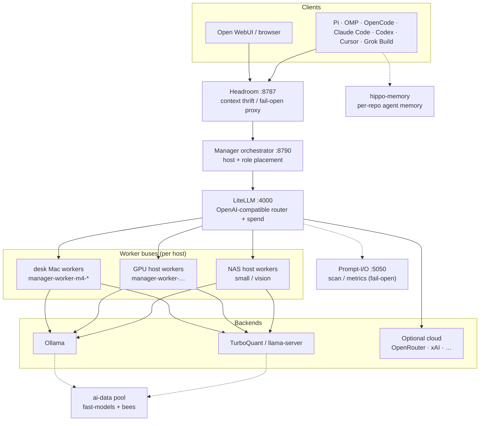
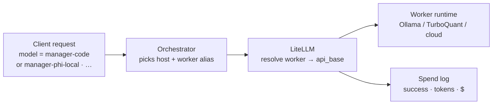
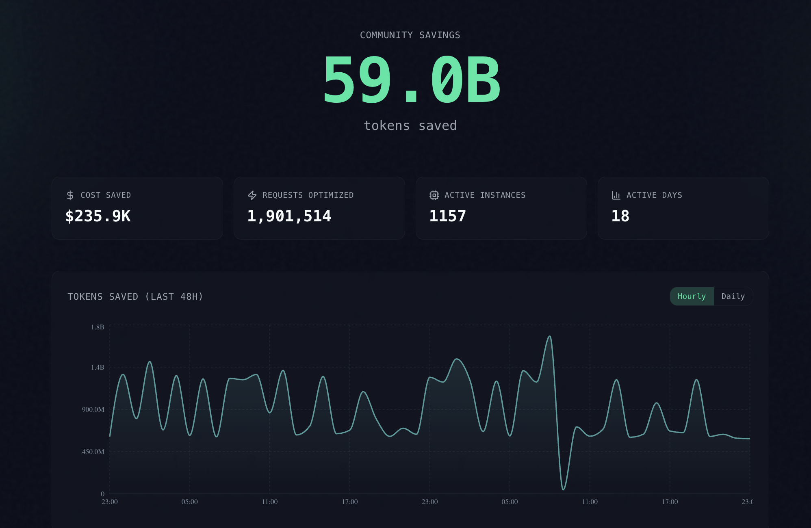
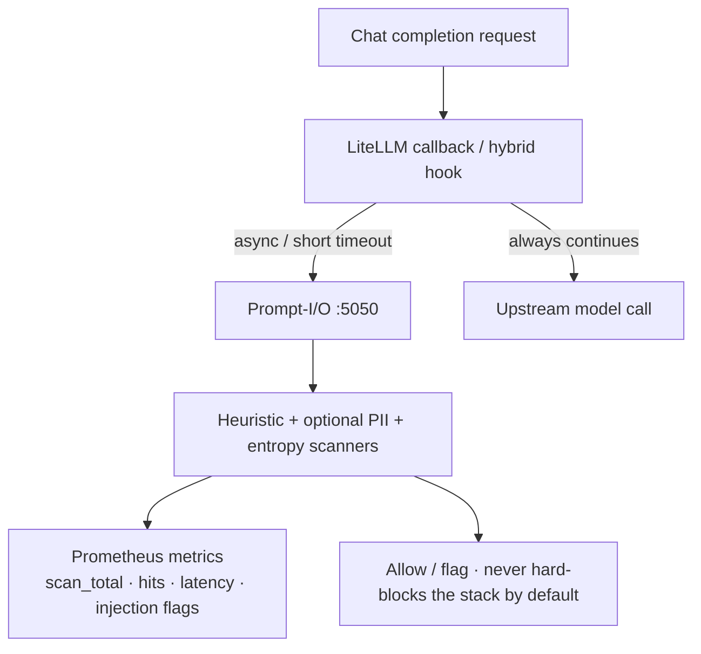
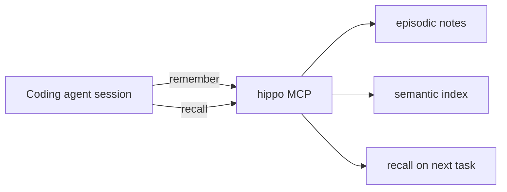
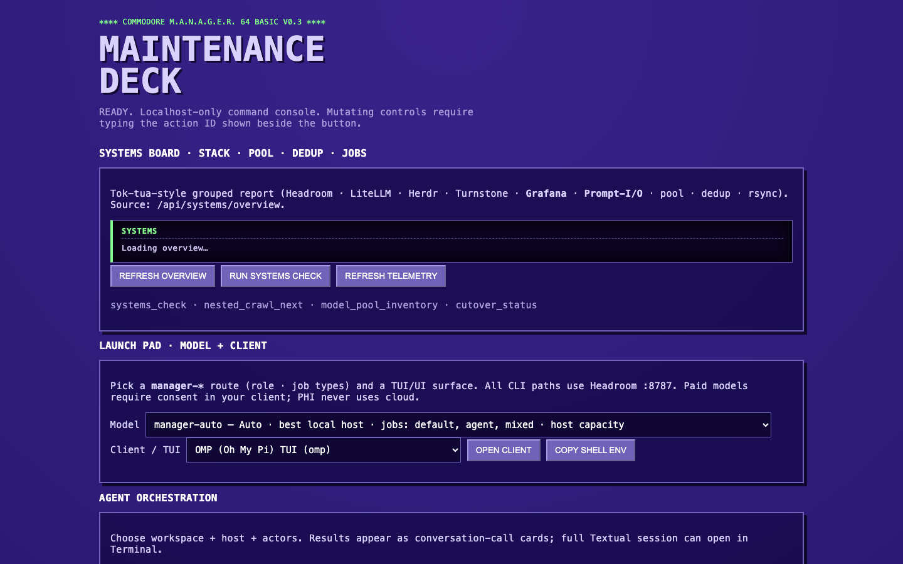
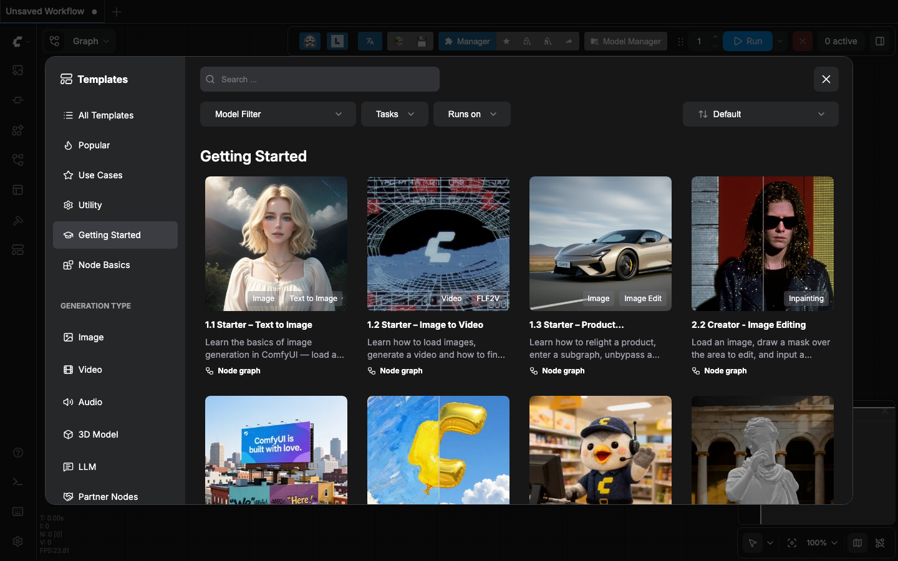

# ai-gateway

One front door for the models and tools in a home AI lab — chat UIs, coding
agents, and scripts aim at the same local gateway instead of five different
API bases and five different failure modes.

This repo is **glue and ops**, not a from-scratch model runtime. The value is
wiring known open-source pieces so they behave as one stack.

## Stack map (what is actually in play)

Clients and agents talk to **Headroom** (`:8787`) for a thrifty path, which
forwards to **LiteLLM** (`:4000`). LiteLLM fans out to local runtimes
(**Ollama**, **TurboQuant**-backed llama-server / optional **vLLM**), cloud
providers you configure, and optional lab services (search, memory, vision).



### How the pieces earn their keep

#### LiteLLM — routing (not a screenshot of empty admin stats)

LiteLLM is the **OpenAI-compatible bus**: aliases in, provider call out, spend logged.



| What we measure (lab snapshot) | Value |
|--------------------------------|------:|
| Proxy liveliness | healthy |
| Recent success / failure mix (spend sample) | **~85% success** (1,261 / 1,480) |
| Tokens on successful sample rows | **~29M** total tokens accounted |
| Global spend counter (local DB) | **~$0.14** (mostly free/local routes) |

Admin UI (`:4000/ui`) is for operators after login — **not** the public hero image. Prefer the diagram above over blank model-stats screenshots.

Upstream: [BerriAI/litellm](https://github.com/BerriAI/litellm) (MIT).

#### Headroom — thrifty front door (context shrink before spend)

Default clients hit **Headroom** first. It sits **in front of** the orchestrator / LiteLLM path and compresses bulky agent context (tool dumps, logs, RAG, history) so fewer tokens hit the model.

<p align="center">
  
</p>

<p align="center"><em>Upstream visual from <a href="https://github.com/chopratejas/headroom">chopratejas/headroom</a> (Apache-2.0) — content-aware compressors shrink what agents send; we run that proxy as the default door at <code>:8787</code>.</em></p>

**What Headroom is for in this gateway**

| Claim | Source |
|-------|--------|
| **60–95% fewer tokens** on compressible JSON / tool dumps; **~15–20%** on typical coding-agent traffic | Upstream Headroom README / benchmarks |
| Proof examples (upstream): code search **17.7k → 1.4k (92%)**, SRE debug **65.7k → 5.1k (92%)** | [chopratejas/headroom](https://github.com/chopratejas/headroom) proof table |
| Accuracy preserved on standard evals (GSM8K / TruthfulQA / SQuAD / BFCL) | Same upstream docs |
| Lab proxy load (this stack) | **~17k** API requests, **~39k** inbound HTTP, fail-open when compression has nothing to do |

Local `/stats` often shows **0% compression** on short smokes (`ping`, model-list traffic) — that is expected. Savings show up on **long agent sessions** with tool/log/RAG bulk, which is why coding CLIs point at Headroom by default.

```text
agent / UI  →  Headroom (:8787)  →  orchestrator  →  LiteLLM  →  worker
                 ↑ shrink context here
```

#### Prompt-I/O — side-channel scan, not on the critical path for failure

Prompt-I/O is a **Vigil-compatible scanner** LiteLLM can call in parallel (hybrid prompt I/O). It is **fail-open**: if it is slow or down, completions still succeed.



| Benefit | Why it is here |
|---------|----------------|
| Injection / jailbreak heuristics | Extra belt on the bus without owning consent/BAA (agents still own that) |
| Optional PII pattern hits | Ops signal, not a HIPAA product |
| Prometheus counters | Deck / Grafana can graph scans without scraping model bodies |
| Fail-open timeout | Gateway stays usable when the scanner is cold |

Health is intentionally boring (`status: ok`) — the value is the **scan path + metrics**, not a pretty JSON screenshot.

#### hippo-memory — per-repo agent memory (not life memory)

<p align="center">
  
</p>

<p align="center"><em><a href="https://github.com/kitfunso/hippo-memory">kitfunso/hippo-memory</a> — agent/coding memory under <code>.hippo/</code> in each repo (MCP). Distinct from <strong>botmem</strong> (life / personal SoR).</em></p>



| Local store signal (example repo `.hippo/stats.json`) | Count |
|-------------------------------------------------------|------:|
| remembered | 1 |
| recalled | 3 |
| forgotten | 0 |

Stats are **per workspace**, not a shared cloud. Hippo keeps agent continuity without stuffing PHI into one global blob.

#### Maintenance Deck + creative path (optional pictures)

<p align="center">
  
</p>

<p align="center"><em><b>Maintenance Deck</b> — ops board for Headroom · LiteLLM · Grafana · Prompt-I/O · CLI versions; launch pad for agents aimed at this gateway.</em></p>

<p align="center">
  
</p>

<p align="center"><em><b>ComfyUI</b> — pixels path (story/creative, e.g. <a href="https://github.com/the1truedan/mok-tua">mok-tua</a>), not chat completions. Weights usually share the <a href="https://github.com/the1truedan/fast-models">fast-models</a> / ai-data pool.</em></p>

Local capture index (ops only): [`docs/assets/stack-local/AI_GATEWAY_CAPTURES.md`](./docs/assets/stack-local/AI_GATEWAY_CAPTURES.md). Upstream image credits: [`docs/assets/upstream/README.md`](./docs/assets/upstream/README.md).

### Core path

| Piece | Role in this stack | Upstream |
|-------|--------------------|----------|
| **[Headroom](https://github.com/chopratejas/headroom)** | Default client entry (`:8787`); conserves context/tokens before LiteLLM. Image: `ghcr.io/chopratejas/headroom` | [chopratejas/headroom](https://github.com/chopratejas/headroom) |
| **[LiteLLM](https://github.com/BerriAI/litellm)** | OpenAI-compatible multi-provider router, aliases (`manager-*` / `tier-*`), spend UI | [BerriAI/litellm](https://github.com/BerriAI/litellm) · [docs](https://docs.litellm.ai/) |
| **[Ollama](https://github.com/ollama/ollama)** | Local model serve (`:11434`); common fallback when TurboQuant is down | [ollama/ollama](https://github.com/ollama/ollama) |
| **TurboQuant-backed local servers** | Host `llama-server`-style endpoints (`:8081` reason, `:8082` coder) for quantized / long-context local work | Method: [TurboQuant paper](https://arxiv.org/abs/2504.19874); ecosystem includes [vLLM TurboQuant notes](https://vllm.ai/blog/2026-05-11-turboquant) and community `llama.cpp` / server integrations |
| **[Open WebUI](https://github.com/open-webui/open-webui)** | Browser chat UI pointed at Headroom (or LiteLLM bypass) | [open-webui/open-webui](https://github.com/open-webui/open-webui) |
| **Docker Compose / Postgres / Redis** | Process layout and LiteLLM DB | Docker, [postgres](https://www.postgresql.org/), [redis](https://redis.io/), [pgvector](https://github.com/pgvector/pgvector) |

### Coding agents (pointed at the gateway)

| Agent / harness | How it fits | Upstream |
|-----------------|-------------|----------|
| **[Pi](https://github.com/badlogic/pi-mono)** | Terminal coding agent; models JSON → Headroom | [badlogic/pi-mono](https://github.com/badlogic/pi-mono) |
| **[Oh My Pi (OMP)](https://github.com/acidsugarx/oh-my-pi)** | Pi-oriented harness / tooling (model lists under `config/clients/omp.*.yml`) | [acidsugarx/oh-my-pi](https://github.com/acidsugarx/oh-my-pi) |
| **[OpenCode](https://github.com/anomalyco/opencode)** | Terminal coding agent; provider snippets → Headroom | [anomalyco/opencode](https://github.com/anomalyco/opencode) · [opencode.ai](https://opencode.ai) |
| **Claude Code / Codex / Cursor / Grok Build** | Third-party CLIs/IDEs using the same `OPENAI_BASE_URL` → Headroom or LiteLLM | Anthropic, OpenAI, Cursor, xAI respectively |

Lab launchers that sit *beside* those CLIs:

| Repo | Role |
|------|------|
| **[grok-tua-tok-tua](https://github.com/the1truedan/grok-tua-tok-tua)** | Launch coding CLIs next to a live health/spend pane |

### Optional profiles (compose)

| Piece | Role | Upstream |
|-------|------|----------|
| **[Hister](https://github.com/asciimoo/hister)** | Local search (`:4433`); profile `search` | [asciimoo/hister](https://github.com/asciimoo/hister) · image `ghcr.io/asciimoo/hister` |
| **[botmem](https://github.com/botmem/botmem)** | Personal / life memory SoR (compose profile `memory`) | [botmem/botmem](https://github.com/botmem/botmem) · images `ghcr.io/botmem/botmem` |
| **[hippo-memory](https://github.com/kitfunso/hippo-memory)** | Agent/coding memory under `.hippo/` per repo (host MCP, not the same as botmem) | [kitfunso/hippo-memory](https://github.com/kitfunso/hippo-memory) · npm `hippo-memory` |
| **[Turnstone](https://github.com/turnstonelabs/turnstone)** | Optional agent/orchestration client path through Headroom | [turnstonelabs/turnstone](https://github.com/turnstonelabs/turnstone) |
| **AIDA / vision-embed / prompt-io** | Lab services in `services/` (document helpers, embeddings, metrics) | This repo (sanitized) |
| **llmtrace-proxy** | Optional request tracing | `ghcr.io/techlab-innov/llmtrace-proxy` |

botmem ≠ hippo: life memory vs agent/project memory. See `config/clients/memory_platform.md` in full trees.

### Storage plane (shared weights, not the chat stack)

| Piece | Role | Upstream |
|-------|------|----------|
| **[fast-models](https://github.com/the1truedan/fast-models)** | Unraid Docker stack: dual NVMe → Btrfs pool → NFS **ai-data** | This org |
| **[bees](https://github.com/Zygo/bees)** | Best-Effort Extent-Same — Btrfs online dedupe agent | [Zygo/bees](https://github.com/Zygo/bees) |
| **Prometheus + Grafana** | Metrics / bees occupancy dashboards | [prometheus](https://prometheus.io/) · [grafana](https://grafana.com/) |

Ops notes we published from real incidents: [`docs/ops/bees/`](./docs/ops/bees/).

### Creative / story path (sibling labs)

| Repo | Role | Typical underlying tools |
|------|------|---------------------------|
| **[mok-tua](https://github.com/the1truedan/mok-tua)** | Script → storyboard stills → optional video | Uses this gateway for LLM expand; **[ComfyUI](https://github.com/comfyanonymous/ComfyUI)** (+ Wan / AnimateDiff / Qwen LoRAs on the model pool) for pixels |
| **ocr-tua** (when published) | Thin OCR/vision HTTP service | Local vision backends |

### Design / custody (docs)

| Repo | Role |
|------|------|
| **[johnny-appleseed-chipper](https://github.com/the1truedan/johnny-appleseed-chipper)** | Process templates for inventory, content-hash duals, public handoff (not a runtime) |

---

## How this came to be

This did **not** start as a product pitch.

**22 March 2026** — earliest “vibecoding” on record: Grok chats about surplus
hardware and a homelab.

**13 April 2026** — the pivot. Real-world harm around my mother’s care made the
hobby stop being a hobby. Within a week: Gateway Technical College’s AI/ML
certificate program, the ACL caregiver prize path, and **M.A.N.A.G.E.R. LLC**
(Delaware, 20 April 2026). The question became: *how do you prepare for the
care when we cannot be there?*

### Phase 1 — orchestration testing

`ai-gateway` grew as **parallel infrastructure** next to the caregiving monorepo
(`grokcode` / M.A.N.A.G.E.R.): multi-host routing (desk Mac, GPU host, NAS),
LiteLLM + Headroom as one door, smoke checks so agents fail *before* a long
session if the stack is dead.

### Phase 2 — local LLM code-agent framework

Same door became the base URL for **Pi / OMP / OpenCode / Claude Code / Codex /
Cursor / Grok Build**. **grok-tua / tok-tua** launch those CLIs and watch
health/spend.

### Phase 3 — cloud as co-workers under deadline

ACL Phase 1 deadline **31 July 2026**: multi-model collaboration (Grok, Claude,
ChatGPT), best concrete step per session, **git as ground truth**, then
sanitized public mirrors.

### Phase 4 — the checklist that was always there

While M.A.N.A.G.E.R. development named agents and ethics gates, this repo
quietly **ticked orchestrator requirements**: one door, local-first, PHI-local
roles, spend visibility, multi-host, fail-early smoke. The path there ran through
**paywalls**, **stateless chat anxiety**, and a long Grok thread that hopped
twitter.com → grok.com → WebUI → Open WebUI history ingest → Grok Build / local
agents — until **ai-gateway** became the solver conduit and **grok-tua / tok-tua /
mok-tua** grew meters and creative tooling *during* ACL last legs and caregiver
hours. Fluke or divine project management — either way the boxes light up.

**→ [`docs/STORY_PARALLEL_PATHS.md`](./docs/STORY_PARALLEL_PATHS.md)** (full path + checkbox map)

### Where **ai-data** fits

Models, Pinokio trees, git mirrors, and caches outgrew per-machine disks.
**ai-data** on the NAS pool (NVMe + Btrfs + bees + NFS) is the shared house.
**fast-models** is that storage plane. Gateway without storage is a doorbell
with no house behind it.

---

## What you get in *this* tree

- Compose files for Mac / Linux / Unraid-shaped layouts
- LiteLLM configs + Headroom as the default thrifty path
- Client snippets for Pi, OMP, OpenCode, and friends (`config/clients/`)
- Optional profiles: search (Hister), memory (botmem), vision, document helpers
- Operator notes, Prometheus scrape sketch, bees/Grafana public ops docs

This public tree is **sanitized**. Home secrets, private care data, and raw
LAN IPs stay off GitHub (roles like `gpu-host` / `nas-host` instead).

## Shared AI pool, bees, and dashboards

| Path | What |
|------|------|
| [`docs/ops/bees/`](./docs/ops/bees/) | Hash sizing HOWTO, **4 G** considerations, 2026-08-01 incident, Grafana/cron shape, L1/L2/L3 ladder |
| [`config/observability/ai-data-bees-dashboard.json`](./config/observability/ai-data-bees-dashboard.json) | Importable Grafana dashboard |
| [`deploy/unraid-fast-models/`](./deploy/unraid-fast-models/) | Sketch of the Unraid pool stack |

**4 G short version:** bees fingerprint table size ≠ disk fullness. We grew
**1 G → 2 G → 4 G** when occupancy hit ~100% on a ~1.5 TiB-used pool. Sticky
RAM ≈ table size; only grow after a full re-crawl still saturates the table.

## Quick start (sketch)

```bash
cp .env.example .env   # if present — fill your own keys
docker compose up -d
# thrifty path for clients:
#   export OPENAI_BASE_URL=http://127.0.0.1:8787/v1
# raw LiteLLM (bypass Headroom):
#   export OPENAI_BASE_URL=http://127.0.0.1:4000/v1
```

You bring backends (Ollama, TurboQuant/llama-server, cloud keys). Nothing here
is a turnkey clinical product.

## Related public pieces (this org)

| Repo | Role |
|------|------|
| [fast-models](https://github.com/the1truedan/fast-models) | Shared NVMe pool (ai-data) |
| [grok-tua-tok-tua](https://github.com/the1truedan/grok-tua-tok-tua) | Coding-CLI launchers + status panes |
| [mok-tua](https://github.com/the1truedan/mok-tua) | Script → storyboard pipeline |
| [johnny-appleseed-chipper](https://github.com/the1truedan/johnny-appleseed-chipper) | Inventory / dual-verify process templates |
| [shreddit](https://github.com/the1truedan/shreddit) | Side utility — first public OSS timed with ACL |

## License / credit

Compose and configs here are released under the repo [LICENSE](./LICENSE).
**Upstream projects keep their own licenses** — always follow Headroom, LiteLLM,
Ollama, Open WebUI, Pi, OpenCode, bees, botmem, hippo-memory, etc. when you
redistribute or run them.

---

<p align="left">
  <a href="https://linktr.ee/the1truedan"></a>
  <a href="https://ko-fi.com/the1truedan"></a>
</p>

**© 2026 M.A.N.A.G.E.R. LLC** — *prepare for the care when we cannot be there*
